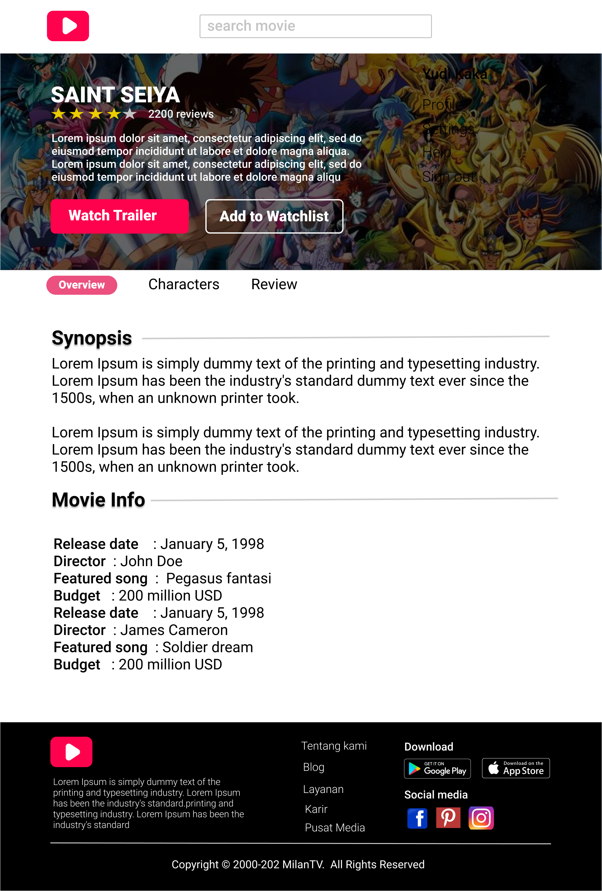

# Deliverable Final Project for Front End

1. Web yang sudah jadi
2. Responsive web
3. Repository
4. Implementasi data dummy / get data dari The Movie Database (TMDB)

## CineFilm Movies-App

Aplikasi ini merupakan sebuah situs web yang memungkinkan pengguna untuk menelusuri daftar film dan mengakses informasi terperinci tentang setiap film. Aplikasi ini mengggunakan API dari `The Movie Database (TMDb)` untuk mengambil data film dan menyajikan informasi seperti pemain, ulasan, dan lainnya. Project ini bertujuan untuk menyelesaikan tugas akhir dalam program `SMKDEV Scholarship - Frontend Developer.`

## Minimum Requirement for Front End

- `Design` - Support Responsive Mobile Design
- `Component` - Custom component
- `Package Manager` - NPM, Vite
- `State Management & Stater Kit` - ReactJS
- `Responsive Screen` - Handphone maksimum width 425px Laptop maksimum width 1024px
- `Deployment` - Netlify
- `Testing` - JEST + React Testing Library
- `Output Deliverable` - https://cinefilm-frontend.netlify.app/

## Technologies

- REACTJS
- AXIOS
- TAILWIND CSS
- VITE
- SWEETALERT2
- FONT-AWESOME
- REACT-RESPONSIVE-CAROUSEL
- REACT-ROUTER-DOM

## Features

- Melakukan pencarian film berdasarkan genre.
- Mengaplikasikan filter pada film berdasarkan jenis genre.
- Menemukan film berdasarkan judul.
- Menampilkan informasi rinci mengenai film, seperti plot, tanggal rilis, sutradara, soundtrack terkenal, anggaran, dan sebagainya.
- Akses informasi karakter yang muncul dalam film.
- Muncul trailer dari film.

## Mockup Figma (https://www.figma.com/file/HWAJ1Me85SrsgZw3ogZijU/movieapp_practice?type=design&node-id=0%3A1&mode=design&t=EtCIONSE4snHCoiA-1)

